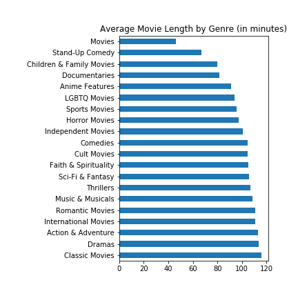
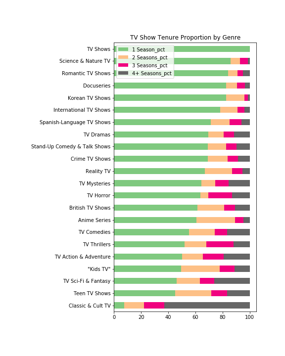
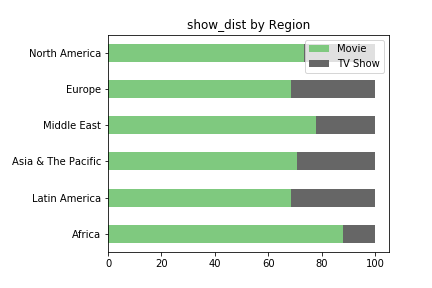

# Netflix Movies & TV Shows

## Description
In this project, I analyzed a dataset that contains movies and TV shows that are available on [Netflix](https://www.netflix.com/).  The dataset, which was pulled from the Kaggle website, can be found [here](https://www.kaggle.com/shivamb/netflix-shows).  There are several questions I sought to answer with this dataset:

**Overview**
1. Change in number of shows/movies available over time.
2. Proportion of shows vs movies.
3. Number of directors, cast members, countries available, and genres.
4. Average lengths for movies and tenure for shows.
5. Most and least common countries, genres, ratings, directors, and cast members.

**Deep Dive**

6. Length of cast by country.
7. Proportion of shows vs movies by country.
8. Range of directors in terms of number of countries.
9. Average movie length by genre and country.
10. TV show tenure by genre.
11. How the content in different regions compares to one another.

**Natural Language Processing**

12. Most common words in descriptions overall and by genre.

## Files
I split my analysis into the following notebooks, all of which are written in Python:
- [Netflix_Overview](https://github.com/albert-ntiri/netflix2/blob/main/Netflix_Overview.ipynb): This notebook contains the initial data clean up steps and answers questions 1-5.
- [Netflix_Deep_Dive](https://github.com/albert-ntiri/netflix2/blob/main/Netflix_Deep_Dive.ipynb): This notebook answers the deep dive questions 6-10 and 12.
- [Netflix_Region_Comparison](https://github.com/albert-ntiri/netflix2/blob/main/Netflix_Region_Comparison.ipynb): This notebook uses object-oriented programming to generate a set of metrics by region to answer question 11.

## Process
Here is the approach I took to complete this analysis:
1. Loaded the CSV file into a pandas dataframe and cleaned it.  The dataset had some missing values in text columns that I filled with a text value of 'Unknown'.  Because 4 of the columns (listed_in, country, director, cast) could have 1 or more values in them, I split these cells into lists to calculate their lengths and used those lists to generate lists of unique values for each of these 4 columns.
2. Used a combination of simple techniques, such as means and frequency tables, and more advanced ones, such as functions, summary tables, and object-oriented programming to tackle each question.

## Insights
Here are some high-level insights from this analysis.  More details can be found in the appropriate notebooks.

1. The majority of the Netflix content at the time this dataset was created is from 2017-2020.  Some earlier content is still available, but it is much less.
2. 69% of the content is movies.  The rest are TV shows.
3. Almost 93% of the content has a single director.  The most common size of a cast is around 8-10, however there are a number of titles that only list 1 cast member.  85% of the content only involves 1 country.  The genre size is more evenly split, with the most common number of genres being 3 and 1 the least common.
4. About 82% of TV shows do not last more than 2 seasons.  Movie lengths resemble a normal distribution with the mean around 100 minutes.  However, there appears to be a separate smaller distribution of short-length films.
5. Here are the most common values (genres: International Movies, Dramas, Comedies; countries: US, India, UK; directors: Jan Suter, Raul Campos, Marcus Raboy; cast members: Anupam Kher, Shah Rukh Khan, Om Puri; ratings: TV-MA, TV-14, TV-PG.
6. The countries with the highest average cast size are Paraguay and Lithuania.
7. Singapore stands out as having more TV shows than movies.
8. Directors have produced work in as many as 31 countries.
9. The genres with the shortest and longest movies are 'Movies' and 'Classic Movies', respectively.  The countries with the shortest and longest movies are Colombia and Morocco, respectively.
10. 'Classic & Cult TV' has a much larger proportion of shows that lasted for more seasons.
11. North America is the only region that does not have 'International Movies' as the top genre.  Africa has a larger proportion of movies than any other region, and of the TV shows it does have, none have lasted more than 2 seasons.  Asia & The Pacific has the longest movies.  North America and Europe have the biggest range of content in terms of the difference between the oldest and newest content based on when it was originally released.  Latin America and the Middle East have the smallest range.  The average cast sizes and average number of directors are relatively similar among the regions.  More of the North American content has only 1 genre.  More of the content in Europe has more than one country involved.
12. There is a noticeable variation in the words most commonly appearing in descriptions for content in different genres.  The visual for this can be viewed [here](https://github.com/albert-ntiri/netflix/blob/main/charts/top_words_by_genre.png).

Here are a few charts showing some of the key insights.

